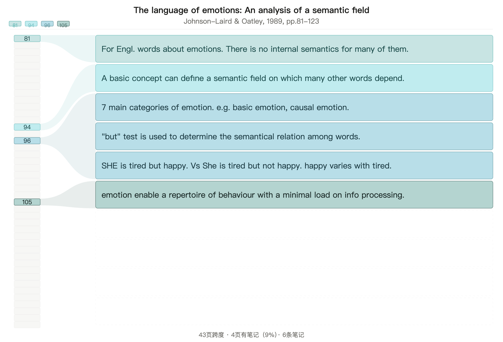

直接访问[此链接](https://ayano7an.github.io/ZbB-eZen-sankey/)使用。

贴入符合格式的论文笔记即可生成Sankey型图形化论文笔记。

例如，笔记

``` txt
The language of emotions： An analysis of a semantic field 
Johnson-laird & Oatley, 1989, pp.81-123
p.81	For Engl. words about emotions. There is no internal semantics for many of them.
p.94	A basic concept can define a semantic field on which many other words depend. 
p.96	7 main categories of emotion. e.g. basic emotion, causal emotion.
p.96	„but“ test is used to determine the semantical relation among words.
p.96	SHE is tired but happy. Vs She is tired but not happy. happy varies with tired.
p.105	emotion enable a repertoire of behaviour with a minimal load on info processing.
```

可以被图形化为：


